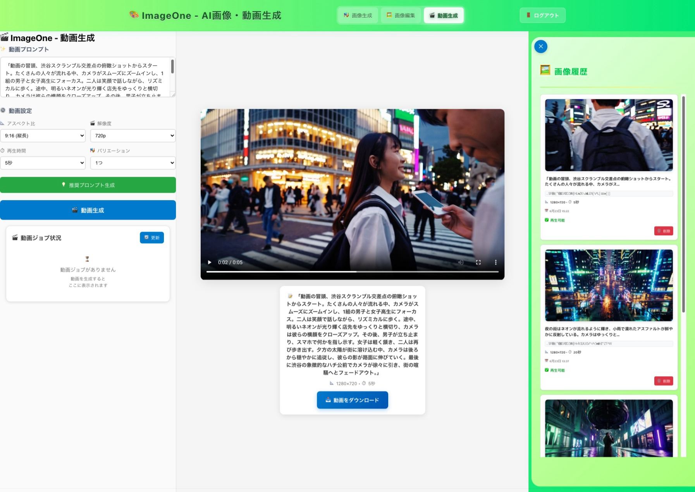

## 🎨 ImageOne - AI画像生成＆編集アプリ + 動画生成機能

Azure OpenAI GPT-4o、GPT-image-1、およびSora動画生成を使った、最新のAI画像・動画生成Webアプリケーションです！✨

## 📸 サンプル画像


*ImageOneのメインインターフェース - 動画生成・画像生成・編集機能を統合したモダンなWebアプリケーション画面*

## 🚀 機能概要

### 🎬 動画生成機能 (NEW!)
- **Azure OpenAI Sora**: 最新の動画生成AIによる高品質動画作成
- **📥 動画ダウンロード**: 完成した動画をワンクリックでMP4ダウンロード
- **🗑️ ジョブ管理**: 実行中・完成・失敗した動画ジョブの手動削除機能
- **🔄 自動整理**: 動画取り込み後の自動ジョブ削除で履歴をクリーンに保持
- **📱 リアルタイム監視**: 動画生成の進捗をリアルタイムで確認
- **🎯 多様な動画設定**: 解像度・秒数・バリエーション数の詳細設定
- **🔧 正確なAPI実装**: Azure OpenAI Video Generation Jobs APIの完全対応

### 🎭 画像生成モード
- **GPT-4oによる推奨プロンプト生成**: 簡単な入力から詳細で効果的なプロンプトを自動生成
- **📸 プロフェッショナルカメラ設定**: 焦点距離・F値・色温度の詳細設定で写真品質を向上
- **🎨 多様な画像スタイル**: 超精細写真・アニメ・3DCG・油絵など14種類のスタイルから選択
- **多サイズ対応**: 1024×1024、1536×1024、1024×1536の3つのサイズに対応
- **高品質生成**: Azure OpenAI最新モデルによる高解像度画像生成

### 🖼️ 画像編集モード (img2img)
- **マスク編集**: 画像の特定部分だけを編集できる高精度マスク機能
- **直感的UI**: マウスドラッグで簡単にマスクを描画
- **部分編集/全体編集**: マスクの有無で自動切り替え
- **色調保持**: 元画像の色合いを保持した自然な編集
- **アスペクト比対応**: 元画像のアスペクト比を自動検出してサイズ調整

### 📱 ユーザー体験
- **Microsoft Entra ID認証**: セキュアなログインシステム
- **リアルタイムプレビュー**: 編集結果をリアルタイムで確認
- **動的履歴表示**: モードに応じて「画像履歴」「動画履歴」「プレゼンテーション履歴」を自動切り替え ✨
- **画像履歴管理**: 生成した画像の自動保存と管理
- **動画履歴管理**: 生成した動画の自動保存と管理（Blob Storage連携）
- **プロンプト履歴**: 過去のプロンプトを簡単に再利用
- **レスポンシブUI**: デスクトップ・タブレット対応

## 🏗️ アーキテクチャ

### フロントエンド (React + TypeScript)
```
app/
├── src/
│   ├── App.tsx           # メインアプリケーション
│   ├── App.css           # スタイリング
│   ├── msalConfig.ts     # Microsoft認証設定
│   └── index.tsx         # エントリーポイント
├── package.json
└── build/                # ビルド済みファイル
```

### バックエンド (Azure Functions + TypeScript)
```
api/
├── generate/             # 画像生成API
├── edit/                # 画像編集API (img2img)
├── generateVideo/       # 動画生成API 🆕
├── downloadVideo/       # 動画ダウンロードAPI 🆕
├── deleteVideoJob/      # 動画ジョブ削除API (Azure OpenAI準拠) 🆕
├── videoHistory/        # 動画履歴API 🆕
├── videoJobs/           # 動画ジョブ状態API 🆕
├── recommend/           # プロンプト推奨API
├── list/                # 画像一覧API
├── delete/              # 画像削除API
├── host.json            # Azure Functions設定
└── package.json
```

### インフラ (Bicep)
```
infra/
├── main.bicep           # Azureリソース定義
└── main.parameters.json # パラメータ設定
```

## 🛠️ 技術スタック

### フロントエンド
- **React 18** - モダンUIライブラリ
- **TypeScript** - 型安全な開発
- **Microsoft MSAL** - Azure認証
- **HTML5 Canvas** - マスク描画機能

### バックエンド
- **Azure Functions** - サーバーレスAPI
- **Node.js + TypeScript** - バックエンドロジック
- **Azure OpenAI** - AI画像生成・編集
- **Azure Blob Storage** - 画像保存
- **Azure Key Vault** - 認証情報管理

### AI/ML
- **GPT-4o** - プロンプト推奨生成
- **GPT-image-1** - 最新画像生成・編集モデル
- **Azure OpenAI Sora** - 高品質動画生成モデル 🆕
- **Content Filter** - コンテンツポリシー適用

## 🎯 主要実装機能

### 📸 プロフェッショナルカメラ設定システム (NEW!)
```typescript
// カメラ設定による高品質プロンプト生成
const buildCameraPrompt = (basePrompt: string): string => {
  const cameraSettings = [
    `shot with ${focalLength}mm lens`,      // 10mm-200mm
    `aperture f/${aperture}`,               // f/2-f/10  
    `${colorTemp}K color temperature`       // 2000K-10000K
  ];
  
  const styleSuffix = getStyleSuffix(); // 14種類のスタイルから選択
  return `${basePrompt}, ${cameraSettings.join(', ')}${styleSuffix}`;
};
```

**対応画像スタイル:**
- 📸 **写真系**: Ultra Realistic Photo, Casual Snapshot, Portrait, Cinematic
- 🎨 **CG系**: 3D Rendered, Digital Art, Concept Art, Photorealistic Render
- 🎭 **アニメ系**: Anime Style, Manga, Studio Ghibli Style, Character Design
- 🖼️ **アート系**: Oil Painting, Watercolor, Sketch Drawing, Impressionist

### 🎨 高度なマスク編集システム
```typescript
// 厳密な白ピクセル検出による高精度マスク
const checkMaskContent = () => {
  // RGB(255,255,255)の厳密な白ピクセル検出
  for (let i = 0; i < imageData.data.length; i += 4) {
    const r = imageData.data[i];
    const g = imageData.data[i + 1];
    const b = imageData.data[i + 2];
    
    // 真っ白以外のピクセルがあればマスクありと判定
    if (r !== 255 || g !== 255 || b !== 255) {
      setHasMaskContent(true);
      return;
    }
  }
};
```

### 🔄 動的サイズ調整
```typescript
// 元画像のアスペクト比に基づく自動サイズ調整
const detectImageSize = (img: HTMLImageElement) => {
  const { width, height } = img;
  
  if (width === height) return "1024x1024";
  if (width > height) return "1536x1024";
  return "1024x1536";
};
```

### 🎭 色調保持システム
```typescript
const enhancedPrompt = `${prompt}

【CRITICAL COLOR PRESERVATION INSTRUCTIONS】:
- PRESERVE ORIGINAL COLORS: 元画像の色温度・色相・彩度・明度を保持
- NO COLOR FILTERS: セピア・ビンテージ・カラーフィルタ効果禁止
- MAINTAIN VIBRANCY: 元の鮮やかさと色強度を保持
- EXACT COLOR MATCHING: 新要素は周囲の色調に合わせる`;
```

## 📦 セットアップ方法

### 1. 前提条件
- Node.js 18以上
- Azure CLI
- Azure Developer CLI (azd)
- Azure OpenAI リソース

### 2. 環境構築
```bash
# リポジトリクローン
git clone https://github.com/c-nova/imageOne.git
cd imageOne

# フロントエンド依存関係インストール
cd app
npm install

# バックエンド依存関係インストール
cd ../api
npm install
```

### 3. Azure設定
```bash
# Azure Developer CLI初期化
azd init

# Azureリソースデプロイ
azd up
```

### 4. 環境変数設定
```bash
# local.settings.json (開発用)
{
  "IsEncrypted": false,
  "Values": {
    "AzureWebJobsStorage": "UseDevelopmentStorage=true",
    "FUNCTIONS_WORKER_RUNTIME": "node",
    "KeyVaultName": "your-keyvault-name",
    "STORAGE_ACCOUNT_NAME": "your-storage-account"
  }
}
```

## 🎮 使い方

### 動画生成 🆕
1. **動画生成パネル**: 左上の動画生成コントロールで設定
2. **プロンプト入力**: 生成したい動画の説明を入力
3. **設定調整**: 解像度（854x480）・秒数（5秒）・バリエーション数（1）
4. **生成実行**: 「動画生成」ボタンでAI動画を生成
5. **進捗確認**: ジョブリストで生成状況をリアルタイム監視
6. **ダウンロード**: 完成後に「📥 取り込み」で履歴追加 + 「📥 ダウンロード」でMP4保存

### 画像生成
1. **モード選択**: 「画像生成」を選択
2. **プロンプト入力**: 生成したい画像の説明を入力
3. **推奨プロンプト**: AIが最適化したプロンプトを提案
4. **サイズ選択**: 1024×1024、1536×1024、1024×1536から選択
5. **生成実行**: 「画像生成」ボタンでAI画像を生成

### 画像編集 (img2img)
1. **モード選択**: 「画像編集（img2img）」を選択
2. **画像アップロード**: 編集したい画像をアップロード
3. **マスク描画**: 変更したい部分を黒いペンでマーク
4. **プロンプト入力**: どう変更したいかを文章で指定
5. **編集実行**: 「部分編集」または「全体編集」で実行

### 💡 マスク編集のコツ
- **黒で塗った部分**: プロンプトに従って編集される
- **塗らなかった部分**: そのまま保持される
- **全体編集**: マスクを描かずに画像全体を編集
- **部分編集**: 特定部分のみを精密に編集

## 🔧 技術的詳細

### API エンドポイント
| エンドポイント | 機能 | 説明 |
|---|---|---|
| `/api/generate` | 画像生成 | プロンプトから新規画像生成 |
| `/api/edit` | 画像編集 | マスクベース画像編集 |
| `/api/generateVideo` | 動画生成 | プロンプトから動画生成 |
| `/api/downloadVideo/{videoId}` | 動画ダウンロード | 完成動画のセキュアダウンロード 🆕 |
| `/api/deleteVideoJob/{jobId}` | 動画ジョブ削除 | Azure OpenAI Video Generation Jobs API経由でジョブ削除 🆕 |
| `/api/recommend` | プロンプト推奨 | GPT-4oによるプロンプト最適化 |
| `/api/list` | 画像一覧 | 生成済み画像の取得 |
| `/api/delete` | 画像削除 | 指定画像の削除 |

### セキュリティ機能
- **Microsoft Entra ID認証**: エンタープライズグレードの認証
- **Azure Key Vault**: 機密情報の安全な管理
- **Content Filter**: 不適切コンテンツの自動検出
- **CORS対応**: クロスオリジンリクエストの適切な処理

### パフォーマンス最適化
- **SAS URL**: 一時的な画像アクセスURL生成
- **Base64キャッシュ**: 編集結果の高速表示
- **動的リサイズ**: メモリ効率的な画像処理
- **連打防止**: 重複リクエストの防止

## 🎨 UI/UX特徴

### 直感的なインターフェース
- **モード切替**: 生成・編集モードの明確な分離
- **リアルタイム表示**: マスク状態の即座な視覚フィードバック
- **プログレス表示**: 処理状況の分かりやすい表示
- **エラーハンドリング**: ユーザーフレンドリーなエラーメッセージ

### レスポンシブデザイン
- **3ペインレイアウト**: 制御・プレビュー・履歴の効率的配置
- **固定サムネイル**: 画面下部の操作しやすいサムネイル
- **動的サイズ調整**: 画面サイズに応じた最適表示

## 🚀 最新アップデート

### v2.3.1 - 動画ジョブ削除機能修正 (2025年6月) 🗑️✨ 🆕
- 🔧 **Azure OpenAI API仕様対応**: 動画ジョブ削除でAzure OpenAI正式エンドポイントを使用
- 🔗 **エンドポイント修正**: `https://api.openai.com/v1/...` → `${endpoint}/openai/v1/...` (Azure OpenAI)
- 🔑 **認証方式修正**: `Authorization: Bearer` → `api-key` ヘッダーに変更
- 📝 **APIバージョン追加**: `?api-version=preview` パラメータを追加してAzure OpenAI仕様に完全準拠
- 🔍 **デバッグ機能追加**: ジョブパネルにJob ID表示でトラブルシューティングを簡単に
- 📊 **詳細ログ実装**: バックエンドでリクエスト/レスポンス詳細をログ出力し、問題特定を迅速化
- ✅ **完全動作確認**: Postman検証済みのAPI仕様でジョブ削除が正常動作

**実装詳細:**
```typescript
// 修正後のAPIコール - Azure OpenAI Video Generation Jobs 完全対応
const deleteResponse = await fetch(
  `${endpoint}/openai/v1/video/generations/jobs/${jobId}?api-version=preview`,
  {
    method: 'DELETE',
    headers: {
      'api-key': apiKey,
      'Content-Type': 'application/json'
    }
  }
);
```

### v2.3.0 - 動画ダウンロード機能完全実装 (2025年6月) 🎬✨
- 🎬 **動画ダウンロード機能**: 完成した動画をワンクリックでダウンロード可能
- 📥 **API認証統一**: downloadVideo APIでMSAL認証を使用し、セキュアなダウンロードを実現
- 🔄 **Cosmos DB接続修正**: videoHistoryコンテナの参照エラーを修正し、PromptHistoryコンテナに統一
- 🎯 **自動削除機能復活**: 動画取り込み後の自動ジョブ削除機能を再有効化
- 🗑️ **手動削除機能**: 実行中・完成・失敗した動画ジョブを手動で削除可能
- 📦 **完全なファイル処理**: Blob Storageから直接動画データを取得してダウンロード
- 🛡️ **エラーハンドリング強化**: ダウンロード失敗時の詳細なエラーメッセージ表示

### v2.2.1 - 画像履歴＆Blobパス修正・認証強化 (2025年6月)
- 🛠️ **画像履歴の統合表示**: Cosmos DBとBlob Storage両方の画像をフロントで統合・重複排除して表示
- 🐛 **user-images二重パス問題修正**: Blob保存パス生成ロジックを修正し、"user-images/ユーザーID/..."の二重構造を解消
- 🔐 **Entra ID認証強制対応**: Cosmos DBのローカル認証無効化に伴い、FunctionsからAAD認証でアクセスするよう修正
- 🧑‍💻 **TypeScript再ビルド必須**: コード修正後は必ず`npx tsc`で再ビルドすること！古いJSが残るとパスバグが再発するので注意
- 📝 **README/セットアップ手順追記**: 認証・ビルド・Blob構造の注意点をREADMEに明記

### v2.2.0 - 認証・マスク処理強化 (2025年6月) 🔥NEW🔥
- 🔧 **マスクサイズ修正**: マスク画像と元画像のサイズ不一致エラーを完全解決
- 🔐 **Key Vault対応認証**: 動的JWT認証システムで認証の安定性向上
- 💾 **Cosmos DB依存排除**: Cosmos DBなしでも安定動作する履歴システム
- 🖼️ **画像表示修正**: 編集後画像の正確な表示・保持機能
- 🎯 **動的リサイズ**: フロントエンドとバックエンドのサイズ計算完全統一
- ⚡ **パフォーマンス改善**: 競合処理の排除による高速化

### v2.1.0 - プロフェッショナルカメラ設定追加 (2025年5月)
- 📸 **カメラ設定システム**: 焦点距離・F値・色温度の詳細調整機能
- 🎨 **14種類の画像スタイル**: 写真・CG・アニメ・アート系の豊富なスタイル選択
- 🎯 **スタイル別最適化**: 各スタイルに応じた専用プロンプト生成
- ✨ **プロフェッショナル品質**: カメラ設定による写真レベルの画像生成
- 🔧 **直感的UI**: ドロップダウンとスライダーによる簡単操作

### v2.0.0 - 2024年12月対応
- ✨ **GPT-image-1対応**: 最新画像生成モデルへの移行
- 🎨 **マスク精度向上**: RGB厳密検出による高精度マスク
- 🔄 **自動マスククリア**: 編集完了後の自動リセット
- 📐 **動的アスペクト比**: 元画像に基づく自動サイズ調整
- 🎭 **色調保持強化**: 詳細な色調保持プロンプト

### v1.5.0 - UI/UX改善
- 🎯 **位置調整**: ボタン配置の最適化
- 💫 **視覚フィードバック**: マスク状態の明確な表示
- 🎪 **エラー改善**: コンテンツフィルタの分かりやすい表示
- 📱 **レスポンシブ**: モバイル対応の向上

## 🤝 コントリビューション

1. このリポジトリをフォーク
2. 機能ブランチを作成 (`git checkout -b feature/amazing-feature`)
3. 変更をコミット (`git commit -m 'Add some amazing feature'`)
4. ブランチにプッシュ (`git push origin feature/amazing-feature`)
5. Pull Requestを作成

## 📄 ライセンス

このプロジェクトはMITライセンスの下で公開されています。

## 🙋‍♀️ サポート

質問や問題がある場合は、[Issues](https://github.com/c-nova/imageOne/issues)でお気軽にお知らせください！

---

**Made with ❤️ and AI by c-nova**

## � 最新の更新履歴

### v2.3.0 (2025-07-01) - 履歴UI改善 & 画像編集最適化 ✨
- **🎨 動的履歴ラベル機能**: 現在のモードに応じて履歴パネルのタイトルが自動変更
  - 画像生成・編集モード: 「🖼️ 画像履歴」
  - 動画生成モード: 「🎬 動画履歴」
  - プレゼンモード: 「📊 プレゼンテーション履歴」
- **🎯 履歴パネル開閉ボタン改善**: ボタンの絵文字もモードに連動（📜/🎬/📊）
- **🖼️ 画像編集API最適化**: OpenAI API非対応サイズを'auto'に自動変換してエラー解消
- **🔧 動画・画像履歴の完全分離**: ジョブ中と履歴を明確に分離、混在・重複を防止
- **📊 サムネイル表示最適化**: ジョブ中はOpenAI API経由、履歴はBlob Storage経由で最適化

### v2.2.1 - 動画機能統合 & 認証強化
- **🎬 動画生成機能**: Azure OpenAI Sora対応、動画ダウンロード・履歴管理
- **🔐 認証システム強化**: Microsoft Entra ID完全対応
- **🗂️ Blobパス構造統一**: 二重パス問題解決、migration script提供

## �🖼️ 画像履歴の仕組み・統合ロジック（v2.2.1以降）

- 画像履歴は「Cosmos DB」と「Blob Storage」両方から取得し、フロントエンドで統合・重複排除して表示されるよ！
- 画像一覧API（/api/list）は両方のデータを返す。フロント側でIDやパスを比較して重複を除外。
- これにより、過去の画像も新しい画像も全部まとめて履歴パネルに表示される！
- 「総生成数」も正確に`totalCount`でカウントされるよう修正済み。

---

## 🗂️ Blobパス構造と二重"user-images"問題の修正

- 以前はBlob Storageに「user-images/user-images/ユーザーID/...」のような二重パスができてたけど、
  `generateUserBlobPath`などのロジックを修正して「user-images/ユーザーID/...」だけになるよう統一！
- 既存の二重パスデータは`api/scripts/migrate-blobs.js`で一括移行できる。
- 新規アップロード・表示・プロキシもすべて新パス構造に対応済み。

---

## 🔄 既存Blobデータの移行（migration script）

- もし古い「user-images/user-images/...」形式のBlobが残ってたら、
  `api/scripts/migrate-blobs.js`をNode.jsで実行して一括で新パスに移動できる！
- 使い方例：
  ```bash
  cd api/scripts
  node migrate-blobs.js
  ```
- 実行前にAzure Storageの接続情報が正しいか確認してね。

---

## 🛠️ セットアップ・運用の注意点

- コード修正後は必ず`npx tsc`でTypeScriptを再ビルド！古いJSが残るとパスバグや型エラーが出るから注意。
- バックエンド起動用の`start_api.sh`は、Azure CLIで`az login`済みか自動チェックするようになったよ。
  ローカルでAPIを動かす前にAzure認証しておくこと！
- Cosmos DBやBlob StorageへのアクセスはEntra ID（AAD）認証が必須。
  - Cosmos DB: Azure Portalで「Azure Cosmos DB Built-in Data Reader」などのロールを自分のアカウントに割り当ててね。
  - Blob Storage: 「Storage Blob Data Contributor」などのロールが必要。
- Functionsのlocal.settings.jsonや環境変数も最新の構成に合わせてね。

---

## 🆘 トラブルシュートTips

- **画像が表示されない/履歴が空になる**
  - `npx tsc`で再ビルドした？古いJSが残ってない？
  - migration scriptでBlobパスを移行した？
  - Cosmos DB/Blob Storageのロール割り当てはOK？
  - Azure CLIで`az login`済み？
- **Cosmos DB/AAD認証エラー**
  - IPファイアウォールで自分のIPが許可されてる？
  - Azure Portalで「Azure Cosmos DB Built-in Data Reader」ロールが自分に付与されてる？
- **Blob Storage認証エラー**
  - 「Storage Blob Data Contributor」ロールが自分に付与されてる？
- **API起動時に認証エラー**
  - `start_api.sh`で`az login`が自動チェックされるけど、失敗したら手動で`az login`してね。

---

これらの内容はv2.2.1以降の重要な変更点＆運用ノウハウだよ！困ったらこのセクションを見てね！
